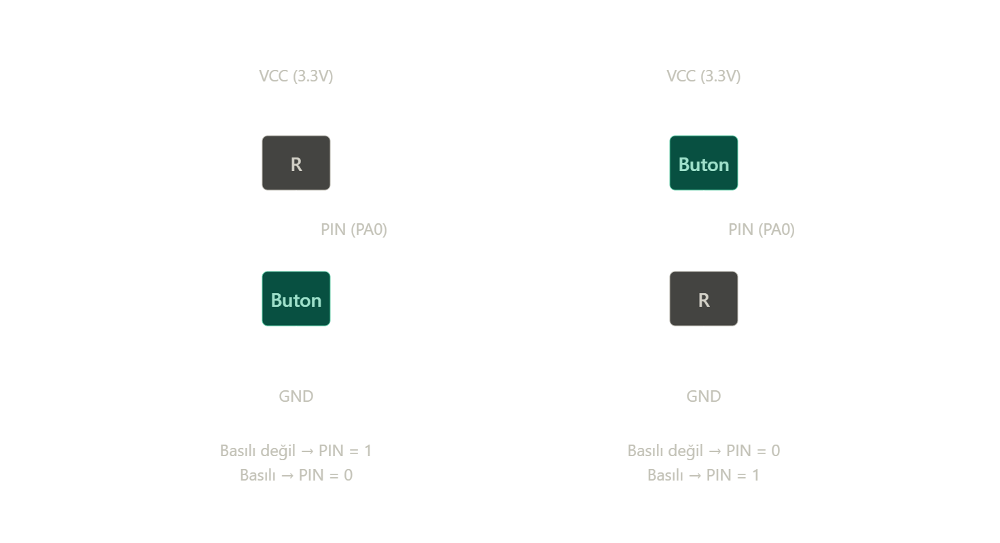

STM32_Embedded_Journey

I am sharing repositories that belongs to STM32 learning projects.

#Repo02 : STM32F407-BUTTON-POLLING

WHAT DID I DO:

I did bare-metal coding via STM32F407-DISC1 in order to button polling in STM32CubeIDE. If button (user button) is pressed, LED12 blinks.Else, LED12 does not work.

CONCEPTUAL MAP:

A button connects or keeps apart the two conductive pins each other. During pins are away , they cannot determines which charge 0 or 1. Thus, they affect from electrical noise and they get randoms values. This case is called “floating pin”. The fix is using pull-up or pull-down resistors. Thanks for it, pins can have default charge.

Pull-down resistor : If button is pressed, pin is always 1. In the other hand, pin is 0. It is used in STM32F407 for user button.
Pull-up resistor : If button is pressed, pin is always 0. In the other hand, pin is 1. 

BONUS RESEARCH:

Why is “uint32_t” used rather than “int” ? 

Because capacity of “int” is depencied of system/platforms. Therefore, using int is unreliable. However, if uint32_ t is used this amount of capacity does not change. It is fixed in 32 bits.

